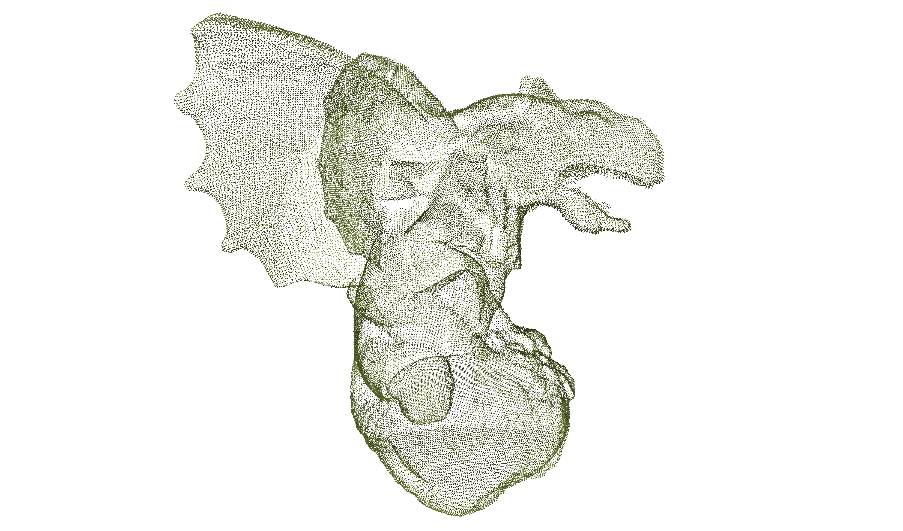
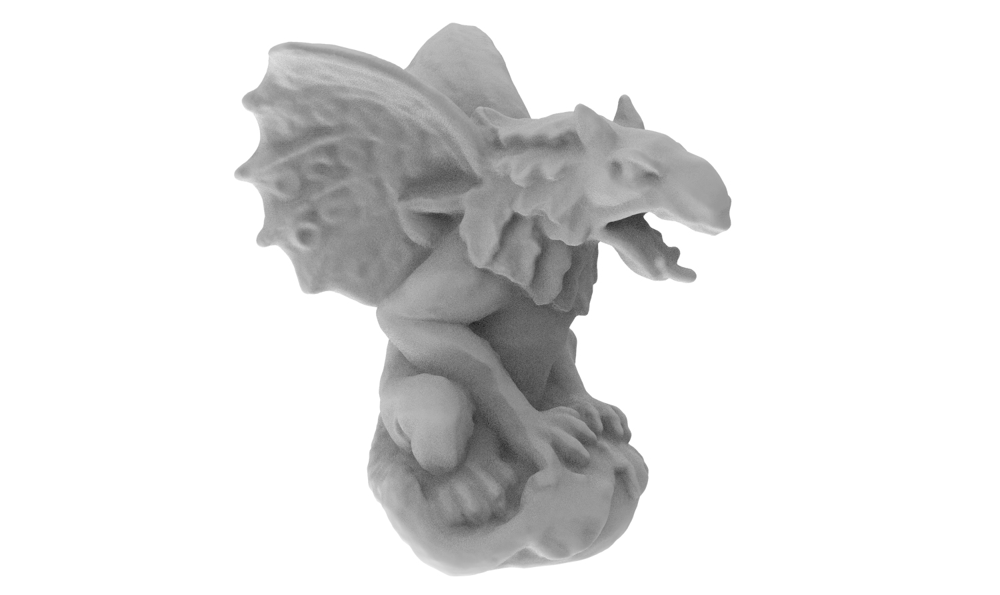

## Neural-Pull: Learning Signed Distance Functions from Point Clouds by Learning to Pull Space onto Surfaces (ICML 2021)


This repository contains the official pytorch version code for the paper.
[Neural-Pull: Learning Signed Distance Functions from Point Clouds by Learning to Pull Space onto Surfaces](https://arxiv.org/abs/2011.13495).

You can find detailed usage instructions for training your own models or running our provided demo below.

If you find our code or paper useful, please consider citing

    @inproceedings{NeuralPull,
        title = {Neural-Pull: Learning Signed Distance Functions from Point Clouds by Learning to Pull Space onto Surfaces},
        author = {Baorui, Ma and Zhizhong, Han and Yu-Shen, Liu and Matthias, Zwicker},
        booktitle = {International Conference on Machine Learning (ICML)},
        year = {2021}
    }

## Tensorflow Version
This repository contains the official pytorch version code for Neural-Pull. If you are more accessible to the tensorflow code, please use [tensorflow repository and star it](https://github.com/mabaorui/NeuralPull), thanks.

## Surface Reconstruction Demo
<p align="left">
  
</p>

## Installation:
Our code is implemented in Python 3.8, PyTorch 1.11.0 and CUDA 11.3.
- Install python Dependencies
```bash
conda create -n npull python=3.8
conda activate npull
conda install pytorch torchvision torchaudio cudatoolkit=11.3 -c pytorch
pip install tqdm pyhocon trimesh PyMCubes scipy
```

## Data:
Surface Reconstruction from Point Cloud. 

We provide the demo data in `data/gargoyle.ply`. If you want to reconstruct your own data, please:
- Put your point cloud data on `./data`.
- Note that we support the point cloud data format of `.ply` and `.xyz`.

## Usage:
```python
python run.py --gpu 0 --conf confs/npull.conf --dataname gargoyle --dir gargoyle
```
You can find the generated mesh and the log in `./outs`.

## License
This project is open sourced under MIT license.
